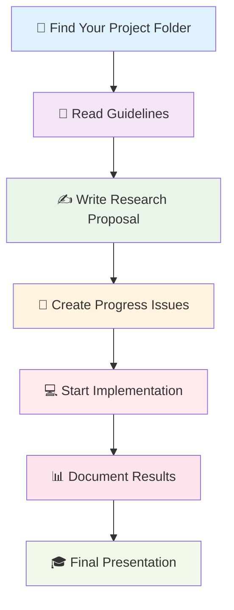

# {MAIN_REPO_NAME}

<div align="center">


### 🎓 **{COURSE_NAME}** Research Projects


</div>

---

## 🔬 Research Innovation Matrix

<div align="center">


</div>

<table align="center">
<tr>
<td align="center" width="300">

### 🤖 **AI Foundation Models**


**🔥 Hot Topics:**
- 🔸 Small LLMs & Efficiency
- 🔸 Mixture of Experts
- 🔸 Edge Computing
- 🔸 Domain-Specific Models


</td>
<td align="center" width="300">

### 🎭 **Multimodal Intelligence**


**🚀 Cutting Edge:**
- 🔸 Vision-Language Models
- 🔸 Video Understanding
- 🔸 Audio-Visual-Text
- 🔸 Multimodal Synthesis


</td>
</tr>
<tr>
<td align="center" width="300">

### 🌐 **3D & Spatial AI**


**🎯 Next-Gen:**
- 🔸 Neural Radiance Fields
- 🔸 3D Scene Understanding
- 🔸 Autonomous Systems
- 🔸 Motion Prediction


</td>
<td align="center" width="300">

### 🏥 **Healthcare AI**


**💡 Life-Changing:**
- 🔸 Medical Imaging
- 🔸 Brain-Computer Interface
- 🔸 DNA Computing
- 🔸 Clinical Decision Support


</td>
</tr>
<tr>
<td align="center" width="300">

### 🛡️ **AI Safety & Ethics**


**🔐 Critical Focus:**
- 🔸 Safety Evaluation
- 🔸 AI Governance
- 🔸 Interpretability
- 🔸 Agentic Evaluation


</td>
<td align="center" width="300">

### 🚀 **Emerging Frontiers**


**🌟 Future-Ready:**
- 🔸 Climate Modeling
- 🔸 Space Technology
- 🔸 Financial Innovation
- 🔸 Cybersecurity AI


</td>
</tr>
</table>

---

## 📊 Project Analytics Dashboard

<div align="center">


<table>
<tr>
<td align="center">

### 📈 **Project Metrics**


</td>
<td align="center">

### 🎯 **Research Impact**


</td>
</tr>
</table>

</div>

---

## ⏱️ Project Timeline & Milestones

<div align="center">

| 📅 **Phase** | 🎯 **Milestone** | 📋 **Deliverables** | 🔄 **Status** | 📊 **Progress** |
|:------------:|:-----------------|:--------------------|:-------------:|:---------------:|
| **Week 1-3** | 📚 Literature Review | Research Proposal + Literature Survey | ✅ Complete |  |
| **Week 4-6** | 🔬 Methodology | Method Design + Validation Plan | 🟡 In Progress |  |
| **Week 7-10** | 💻 Implementation | Code + Initial Results | 🔄 Starting |  |
| **Week 11-13** | 🧪 Experimentation | Analysis + Evaluation | ⏳ Pending |  |
| **Week 14-16** | 📖 Documentation | Final Report + Presentation | 📋 Planned |  |

</div>

---

## 🏗️ Repository Architecture

<details>
<summary><strong>📁 Click to explore project structure</strong> 👈</summary>

```
📦 {MAIN_REPO_NAME}/
├── 🔬 projects/                         # Student Research Workspace
│   ├── 📁 [001-085]-[RESEARCH-AREA]/    # Individual project folders
│   │   ├── 📄 README.md                 # Project overview & objectives
│   │   ├── 📂 docs/                     # Research documentation
│   │   │   ├── 📝 literature_review.md  # Literature analysis
│   │   │   ├── 📊 methodology.md        # Research methodology
│   │   │   └── 📈 results.md           # Findings & analysis
│   │   ├── 📂 src/                      # Implementation code
│   │   ├── 📂 data/                     # Datasets & preprocessing
│   │   ├── 📂 experiments/              # Experimental results
│   │   └── 📂 results/                  # Final outputs
├── 📚 docs/                             # Course documentation
│   ├── 📄 project_overview.md           # Course requirements
│   ├── 📄 project_guidelines.md         # Student guidelines
│   └── 📄 supervisor_guide.md           # Faculty handbook
├── 📋 templates/                        # Project templates
└── 📄 README.md                         # This navigation file
```

</details>

---

## 🎯 Quick Access Portal

<div align="center">

### **🚀 Get Started Instantly**

[](docs/project_guidelines.md)
[](docs/supervisor_guide.md)
[](templates/)
[](../../issues)

### **📊 Project Management**

[](../../projects)
[](../../discussions)
[](../../wiki)

</div>

---

## 📋 Student Workflow

<div align="center">


</div>

### 🗺️ **Your Research Journey**



---

## 👨‍🏫 Supervisor Dashboard

<div align="center">

### **📊 Monitoring & Support Tools**

| 🎯 **Function** | 📱 **Tool** | ⚡ **Access** |
|:---------------:|:------------|:-------------:|
| 👀 **Monitor Progress** | GitHub Issues + Projects |  |
| 💬 **Weekly Check-ins** | Issue Comments |  |
| 📊 **Track Milestones** | Project Boards |  |
| 📝 **Provide Feedback** | Pull Request Reviews |  |

</div>

---

## 🎨 Research Area Showcase

<div align="center">


</div>

<details>
<summary><strong>🤖 Foundation Models & Language AI</strong> 📊 <em>25 Active Projects</em></summary>

| 🔥 **Research Focus** | 📈 **Complexity** | 🎯 **Impact** | 📱 **Applications** |
|:---------------------|:------------------:|:-------------:|:-------------------|
| 📝 Small LLMs |  |  | Edge Devices, Mobile AI |
| 🧠 Mixture of Experts |  |  | Efficient Large Models |
| 🔍 Retrieval-Augmented Generation |  |  | Knowledge Systems |
| 🗣️ Speech Processing |  |  | Voice Assistants |

</details>

<details>
<summary><strong>🎭 Multimodal & Vision AI</strong> 📊 <em>18 Active Projects</em></summary>

| 🔥 **Research Focus** | 📈 **Complexity** | 🎯 **Impact** | 📱 **Applications** |
|:---------------------|:------------------:|:-------------:|:-------------------|
| 👁️ Vision-Language Models |  |  | AI Understanding |
| 🎬 Video Understanding |  |  | Content Analysis |
| 🎯 Object Detection |  |  | Autonomous Vehicles |
| ✨ Super Resolution |  |  | Media Enhancement |

</details>

<details>
<summary><strong>🏥 Healthcare & Medical AI</strong> 📊 <em>15 Active Projects</em></summary>

| 🔥 **Research Focus** | 📈 **Complexity** | 🎯 **Impact** | 📱 **Applications** |
|:---------------------|:------------------:|:-------------:|:-------------------|
| 🧠 Brain-Computer Interface |  |  | Neural Prosthetics |
| 🏥 Medical Imaging |  |  | Diagnostic Tools |
| 🧬 DNA Computing |  |  | Precision Medicine |
| 🩺 Medical Segmentation |  |  | Surgery Planning |

</details>

<details>
<summary><strong>🚀 Emerging Technologies</strong> 📊 <em>12 Active Projects</em></summary>

| 🔥 **Research Focus** | 📈 **Complexity** | 🎯 **Impact** | 📱 **Applications** |
|:---------------------|:------------------:|:-------------:|:-------------------|
| 🌍 Climate AI |  |  | Climate Modeling |
| 🛰️ Space AI |  |  | Spacecraft Systems |
| 💰 Financial AI |  |  | Trading Systems |
| 🔐 Cybersecurity AI |  |  | Threat Detection |

</details>

---

## 🎪 Interactive Features

<div align="center">

### **🎮 Explore Our Research Ecosystem**

[](projects/)
[](docs/research_map.md)
[](https://github.com/{GITHUB_USERNAME}/{REPO_NAME}/projects)
[](../../discussions)

</div>

---

## 🆘 Support Matrix

<div align="center">

| 🎯 **Need Help With** | 📍 **Contact Method** | ⚡ **Response Time** | 🏷️ **Priority** |
|:----------------------|:----------------------|:-------------------:|:----------------:|
| 🐛 **Technical Issues** | [Create Issue](../../issues/new?template=technical.md) |  |  |
| 📚 **Academic Questions** | Contact Supervisor |  |  |
| 💡 **Research Ideas** | [Discussions](../../discussions) |  |  |
| 🚨 **Urgent Issues** | Email Coordinator |  |  |

</div>

---

<div align="center">

## 🌟 Excellence in AI Research


---

**🏛️ Department of Computer Science & Engineering**

[](https://github.com/{GITHUB_USERNAME})
[](.)
[](LICENSE)
[](.)


</div>
